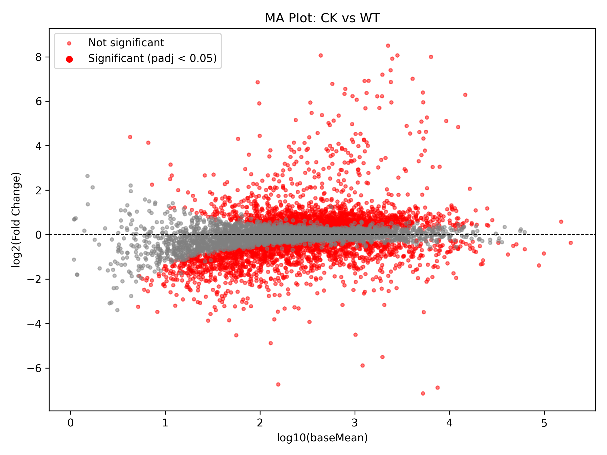

## 🧬 RNA-seq Pipeline for GSE218408: *Pseudomonas aeruginosa* Exposure to Platinum Nanoparticles

### 📌 Project Summary

This pipeline performs RNA-seq data processing, quality control, trimming, transcript quantification, and differential gene expression analysis based on the dataset **[GSE218408](https://www.ncbi.nlm.nih.gov/geo/query/acc.cgi?acc=GSE218408)**.

The study investigates how long-term exposure (\~7200 generations) to platinum nanoparticles (PtNPs) at 12.5 μg/mL affects *Pseudomonas aeruginosa PAO1*, revealing increased antibiotic susceptibility and altered gene expression profiles.

---

### 🧾 Data Source

* **GEO Accession**: GSE218408
* **Organism**: *Pseudomonas aeruginosa*
* **Platform**: Illumina HiSeq 2500 (GPL18287)
* **BioProject**: [PRJNA903796](https://www.ncbi.nlm.nih.gov/bioproject/PRJNA903796)
* **Samples**:

  * WT (Wild-type): GSM6744366–68
  * CK (Control, evolved without PtNPs): GSM6744369–71
  * ES (Exposed, evolved with PtNPs): GSM6744372–74
* **Raw Data**: [NCBI SRA](https://www.ncbi.nlm.nih.gov/sra)
* **Processed Files**: GSE218408\_RAW\.tar

---

### 🛠 Pipeline Overview

This workflow is implemented using **Snakemake** and organized into modular rules. It covers the following stages:

1. **Download & Convert SRA** → FASTQ
2. **Quality Control** → FASTQC & MultiQC
3. **Trimming** → Adapter/quality trimming using Trimmomatic
4. **Quantification** → Transcript-level quantification via Salmon
5. **Differential Expression Analysis** → DESeq2
6. **Visualization** → PCA, Volcano plots, etc.

---

### 📁 Directory Structure (Simplified)

```
.
├── config/               # Config files (YAML, samples table)
├── data/                 # Input metadata or download references
├── envs/                 # Conda environments for each rule
├── resources/            # Genome and adapter resources
├── rules/                # Snakemake rules (modular)
├── scripts/              # R scripts (e.g. DESeq2 analysis)
├── results/              # Output files (FASTQ, QC, Salmon, DEGs, etc.)
├── Snakefile             # Main Snakemake workflow
└── README.md             # This file
```

---

### 🔧 Requirements

* Snakemake ≥ 7.x
* Conda (Miniconda or Anaconda)
* Internet access (for SRA downloads & indexing)

---

### 📊 Outputs

* `results/qc/` → FASTQC reports & MultiQC summary
* `results/trim/` → Trimmed FASTQ files
* `results/salmon/` → Quantification results (`quant.sf`)
* `results/dge_results_*.csv/.xlsx` → DEGs
* `results/pca_plot.pdf`, `volcano_*.pdf` → Visualizations

---

### 🧬 Sample Overview

This study includes **9 RNA-seq samples** across three experimental conditions:

| Sample Accession | Sample Name | Experimental Condition                       | SRA Run     |
| ---------------- | ----------- | -------------------------------------------- | ----------- |
| GSM6744366       | WT-1        | Wild-type *P. aeruginosa* (WT)               | SRR22355218 |
| GSM6744367       | WT-2        | Wild-type *P. aeruginosa* (WT)               | SRR22355219 |
| GSM6744368       | WT-3        | Wild-type *P. aeruginosa* (WT)               | SRR22355220 |
| GSM6744369       | CK-1        | Evolved without PtNPs exposure (Control, CK) | SRR22355221 |
| GSM6744370       | CK-2        | Evolved without PtNPs exposure (Control, CK) | SRR22355222 |
| GSM6744371       | CK-3        | Evolved without PtNPs exposure (Control, CK) | SRR22355223 |
| GSM6744372       | ES-1        | Evolved after 60-day PtNPs exposure (ES)     | SRR22355224 |
| GSM6744373       | ES-2        | Evolved after 60-day PtNPs exposure (ES)     | SRR22355225 |
| GSM6744374       | ES-3        | Evolved after 60-day PtNPs exposure (ES)     | SRR22355226 |

**Condition groups:**

* **WT**: Wild-type strains
* **CK**: Non-exposed but evolved PAO1 (Control)
* **ES**: PtNP-exposed and evolved PAO1

---

## 📈 Results

Differential gene expression analysis was performed using **DESeq2** in R, comparing transcript abundance across three experimental conditions:

* **CK vs WT**: Evolved vs Wild-type (no PtNP exposure)
* **ES vs CK**: PtNP-exposed vs Evolved (control)
* **ES vs WT**: PtNP-exposed vs Wild-type

Significance thresholds used:

* Adjusted p-value (`padj`) < **0.05**
* Absolute log2 fold change > **1** (implied from strong signal)

| Comparison   | Notable Changes                     | Interpretation                                                            |
| ------------ | ----------------------------------- | ------------------------------------------------------------------------- |
| **CK vs WT** | Major transcriptional shifts        | Evolution alone (without PtNPs) alters gene expression                    |
| **ES vs CK** | Substantial differential expression | PtNP exposure causes distinct stress-response or adaptation gene profiles |
| **ES vs WT** | Strongest expression divergence     | Combined effects of evolution + PtNP exposure on global gene regulation   |

### 🧬 Top Differentially Expressed Genes

**CK vs WT**

* Downregulated: `ENSB:jQ5z2HNgTqzPy_A` (log2FC: –6.88)
* Upregulated: `ENSB:9IK76psBkL_GHhq` (log2FC: +7.99)

**ES vs CK**

* Downregulated: `ENSB:6OwFdjo0uF3Ve-6` (log2FC: –6.49)
* Upregulated: `ENSB:VUxK96zPgBtdmN_` (log2FC: +3.98)

**ES vs WT**

* Downregulated: `ENSB:6OwFdjo0uF3Ve-6` (log2FC: –6.56)
* Upregulated: `ENSB:9IK76psBkL_GHhq` (log2FC: +8.84)

---

### 🌋 Volcano Plot Snapshots

These plots visualize the distribution of gene significance (−log10 adjusted p-value) versus effect size (log2 fold change):

* **[Volcano: CK vs WT](./results/volcano_CK_vs_WT.pdf)**
* **[Volcano: ES vs CK](./results/volcano_ES_vs_CK.pdf)**
* **[Volcano: ES vs WT](./results/volcano_ES_vs_WT.pdf)**

---


## 🧪 Visualizations

### 📉 MA Plots

MA (Mean-Average) plots display the relationship between the **mean expression** and the **log2 fold change** of genes in each comparison. Genes that are significantly differentially expressed (`padj < 0.05`) are shown in red.

#### CK vs WT



#### ES vs CK


#### ES vs WT


These plots reveal global shifts in gene expression:

* **CK vs WT**: Expression differences due to long-term evolution without nanoparticle exposure.
* **ES vs CK**: Distinct changes attributed to nanoparticle stress.
* **ES vs WT**: Combined effect of evolution and PtNP exposure.

---

### 🔥 Heatmap of Top 20 Differentially Expressed Genes

This heatmap visualizes the expression of the **top 20 genes (by adjusted p-value)** between PtNP-exposed (ES) and wild-type (WT) samples. Expression values are **z-score normalized** across genes.


* **Red** indicates higher-than-average expression
* **Blue** indicates lower-than-average expression

This plot highlights **clear transcriptional signatures** that distinguish nanoparticle-exposed samples from unexposed ones.

---

### 📄 Citation

**Original Study**:

> Lian Y, Wang M. *Effect of long-term exposure of platinum nanoparticles on gene expression of Pseudomonas aeruginosa PAO1*. GEO Accession: GSE218408. Zhejiang Gongshang University, China.
